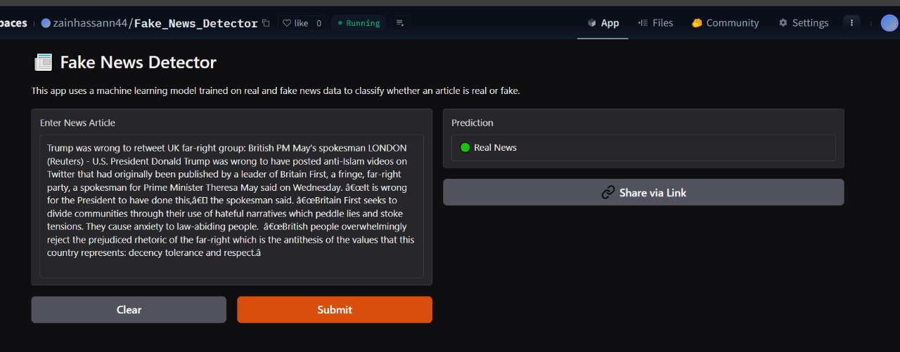

# 📰 Fake News Detection using Machine Learning



## 🌟 Overview

This project implements a machine learning-based solution for detecting fake news articles. Using natural language processing and machine learning techniques, the system can analyze news content and classify it as either real or fake with high accuracy.

## 🚀 Live Demo

Try out the live demo of our Fake News Detection system:
[Fake News Detector on Hugging Face Spaces](https://huggingface.co/spaces/zainhassann44/Fake_News_Detector)

## 🛠️ Features

- Real-time news article classification
- User-friendly web interface
- High-accuracy machine learning model
- Support for long-form news articles
- Instant prediction results

## 💻 Technical Stack

- Python
- Scikit-learn
- Pandas
- Gradio
- Joblib

## 📋 Project Structure

```
├── app.py              # Gradio web application
├── Model.ipynb         # Model training notebook
├── Model1.ipynb        # Alternative model training notebook
├── model.pkl           # Trained model file
├── requirements.txt    # Project dependencies
└── fake_and_real_news.csv  # Dataset
```

## 🚀 Getting Started

1. Clone the repository:
```bash
git clone https://github.com/zainhassanee/Fake_News_Detector_Using_ML.git
```

2. Install dependencies:
```bash
pip install -r requirements.txt
```

3. Run the application:
```bash
python app.py
```

## 📊 Model Performance

The model has been trained on a diverse dataset of real and fake news articles, achieving high accuracy in classification tasks. The system uses advanced natural language processing techniques to analyze the content and context of news articles.

## 🤝 Contributing

Contributions are welcome! Please feel free to submit a Pull Request.

## 📝 License

This project is open source and available under the MIT License.

## 👨‍💻 Author

- Zain Hassan
- GitHub: [zainhassanee](https://github.com/zainhassanee)

## 🙏 Acknowledgments

- Dataset providers
- Open source community
- Contributors and supporters

---

⭐ Star this repository if you find it helpful! 